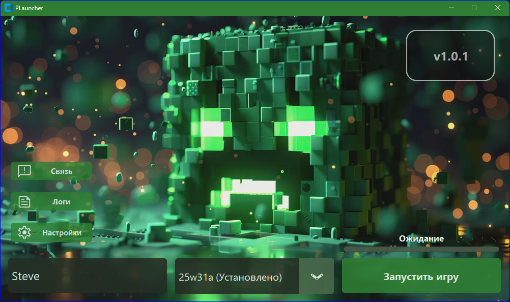

# PLauncher


[](https://github.com/PLauncher-Team/PLauncher/releases)

<div align="center">
  
</div>

**PLauncher** is a modern, feature-rich Minecraft launcher designed to be fast, intuitive, and highly customizable.
It supports official Mojang versions, mod loaders, skin management, localization, and much more — all in one lightweight application.
Whether you're a casual player or a power user, PLauncher provides the tools you need to launch and manage your Minecraft experience with ease.

---

## 📚 Table of Contents
- [Installation](#-installation)
- [Requirements](#-requirements)
- [Key Features](#-key-features)
- [Building from Source](#-building-from-source)
- [Development Mode](#-development-mode)
- [Resources](#-resources)
- [License](#-license)
- [Support the Project](#-support-the-project-donations)
- [Disclaimer](#-disclaimer)

---

## 📥 Installation

To install PLauncher, follow these simple steps:

1. Go to the [Releases page](https://github.com/PLauncher-Team/PLauncher/releases) on GitHub.
2. Download the latest version from the assets.
3. Extract the archive to a folder of your choice.
4. Double-click the `main.exe` file to launch PLauncher.

No additional setup is required — just download and run!

---

## 💻 Requirements

* Windows 10 (64-bit) or higher
* Broadband internet connection

---

## ⭐ Key Features

* **Automatic Minecraft Version Management**

    * Download official releases, snapshots, and legacy alpha/beta builds.

* **Profile Management**

    * Create, select, and delete profiles, each with its own `mods` folder.

* **Java Configuration**

    * Manually specify a custom `java.exe` path.
    * Add JVM arguments for optimized performance.

* **Loader Support**

    * Built‑in support for Forge, Fabric, Quilt, NeoForge, OptiFine.
    * View and install available loader versions with one click.

* **Adaptive Theme & UI Scaling**

    * Dynamic interface scaling to suit different screen resolutions.

* **Localization**

    * Multi-language support: English, Русский, Español, Українська, Беларуская.

* **Skin Management**

    * Preview, upload, and apply Minecraft skins directly within the launcher.

* **Log Viewer**

    * View crash logs and get a solution instantly thanks to AI analysis!

* **Feedback Module**

    * Send feature requests, bug reports, and general feedback without leaving PLauncher.

* **Offline launch**
    * Launch Minecraft without authentication or internet connection. 

---

## 🛠 Building from Source

To build **PLauncher** from the source code, follow these steps.

### Prerequisites

* **Python 3.10+**: [https://www.python.org/downloads/release/python-3100/](https://www.python.org/downloads/release/python-3100/)
* **Microsoft C++ Build Tools**: [https://visualstudio.microsoft.com/visual-cpp-build-tools/](https://visualstudio.microsoft.com/visual-cpp-build-tools/)
* **Git**: [https://git-scm.com/downloads](https://git-scm.com/downloads)

### Steps

1. **Clone the repository**

   ```bash
   git clone https://github.com/PLauncher-Team/PLauncher.git
   cd PLauncher
   ```

2. **Run the build script**

   ```bash
   python build.py
   ```
    * Automatically installs all dependencies and generates `main.exe` (Windows) under `dist/main.dist/` via Nuitka

3. **Launch the built executable**

   ```bash
   cd dist/main.dist
   ./main.exe
   ```

You now have a locally built copy of **PLauncher**, ready for testing or distribution! 🙌

---

## 🚀 Development Mode

During development, you can quickly bootstrap and run the app using our `run.py` helper script:

### Prerequisites

* **Git**: [https://git-scm.com/downloads](https://git-scm.com/downloads)
* **Python 3.10+**: [https://www.python.org/downloads/release/python-3100/](https://www.python.org/downloads/release/python-3100/)

### Steps

1. **Clone the repository**  
   ```bash
   git clone https://github.com/PLauncher-Team/PLauncher.git
   cd PLauncher
    ```

2. **From the project root, execute:**

   ```bash
   python run.py
   ```
    * It launches `main.py` in development mode.


---

## 📦 Resources

See [USED\_LIBS.md](USED_LIBS.md) for a full list of library licenses.

---

## 📄 License

This project is licensed under the [MIT License](LICENSE).

---

## 📢 Disclaimer

PLauncher is an independent project and is **not affiliated with Mojang, Microsoft, or Minecraft**.  
All trademarks, including "Minecraft", are the property of their respective owners.  
Please purchase the game from [minecraft.net](https://www.minecraft.net/) to support the official developers.

---

## 💰 Support the Project (Donations)

If you like PLauncher, please support us with a cryptocurrency donation:

| Cryptocurrency | Address                                      | QR Code                                               |
|----------------|----------------------------------------------|-------------------------------------------------------|
| USDT (TRC20)   | `THqGaKcE2Lui483fqpaFxYMqXZ5wgcSHJA`         |  |
| Bitcoin        | `bc1qgsnfj0de6fm89thpqev0xcc3483kunrtf56e9z` |    |
| Ethereum       | `0x5132B071b4bFFd5a3ccAF70448166DAB590bA0F2` |    |

Thank you for your support! 🙏
