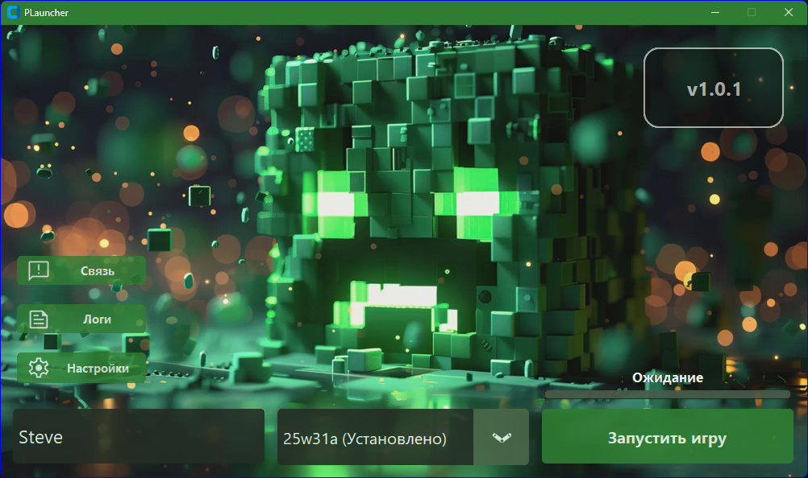
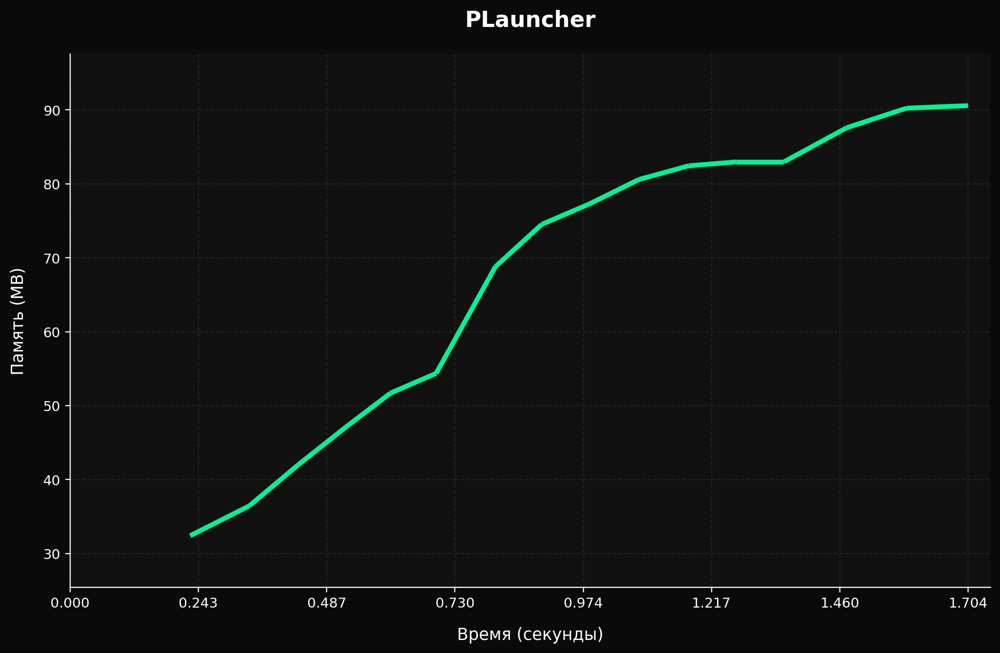

# PLauncher

[](https://github.com/PLauncher-Team/PLauncher/releases)
[](https://github.com/PLauncher-Team/PLauncher/actions/workflows/build-windows-release.yml)

<div align="center">
  
</div>

**PLauncher** - это удобный и лёгкий лаунчер для Minecraft, объединяющий поддержку официальных версий, модов и кастомизацию скинов. Он обеспечивает быстрый запуск игры и простую настройку в интуитивном интерфейсе.

---

## 📚 Содержание
- [Установка](#-установка)
- [Требования](#-требования)
- [Ключевые возможности](#-ключевые-возможности)
- [Сборка из исходного кода](#-сборка-из-исходного-кода)
- [Режим разработки](#-режим-разработки)
- [Ресурсы](#-ресурсы)
- [Лицензия](#-лицензия)
- [Поддержать проект](#-поддержать-проект-пожертвования)
- [Отказ от ответственности](#-отказ-от-ответственности)

---

## 📥 Установка

Чтобы установить PLauncher, выполните эти простые шаги:

1. Перейдите на [страницу релизов](https://github.com/PLauncher-Team/PLauncher/releases) на GitHub.
2. Скачайте последнюю версию.
3. Запустите установщик.
4. Следуйте инструкциям на экране.

---

## 💻 Требования

* Windows 10 (64-бит) или новее
* Широкополосное подключение к интернету

---

## ⭐ Ключевые возможности

* **Автоматическое управление версиями Minecraft**

    * Скачивание официальных релизов, снапшотов и устаревших альфа/бета-сборок.

* **Управление профилями**

    * Создание, выбор и удаление полностью изолированных профилей с отдельными данными игры и настройками.

* **Настройка Java**

    * Полноценное управление версиями Java
    * Возможность добавления JVM аргументов

* **Поддержка загрузчиков**

    * Встроенная поддержка Forge, Fabric, Quilt, NeoForge, OptiFine, Cleanroom.
    * Просмотр и установка доступных версий загрузчиков в один клик.

* **Адаптивная тема и масштабирование интерфейса**

    * Динамическое масштабирование интерфейса под разные разрешения экрана.

* **Локализация**

    * Поддержка нескольких языков: English, Русский, Español, Українська, Беларуская.

* **Поддержка Ely.by**

    * Полное управление скинами: предпросмотр, загрузка и смена образа.

* **Просмотр логов**

    * Просматривайте логи сбоев и мгновенно получайте решение благодаря анализу ИИ!

* **Модуль обратной связи**

    * Отправляйте запросы функций, отчёты об ошибках и общие отзывы, не покидая PLauncher.

* **Офлайн-запуск**
    * Запуск Minecraft без аутентификации или подключения к интернету.

* **Производительность и легковесность**
<table border="0">
  <tr>
    <td width="40%">
      <p><b>Моментальный запуск:</b> лаунчер полностью готов к работе менее чем за 3 секунды.</p>
      <p><b>Минимальное потребление ресурсов:</b> в пике потребляет до 100 МБ оперативной памяти, что делает его одним из самых нетребовательных лаунчеров.</p>
      <p><b>Компактный размер:</b> сам установщик весит не больше 30 МБ.</p>
    </td>
    <td width="60%">
      
    </td>
  </tr>
</table>

---

## 🛠 Сборка из исходного кода

Чтобы собрать **PLauncher** из исходного кода, выполните следующие шаги.

### Необходимые компоненты

* **Python 3.10+**: [https://www.python.org/downloads/release/python-3100/](https://www.python.org/downloads/release/python-3100/)
* **Microsoft C++ Build Tools**: [https://visualstudio.microsoft.com/visual-cpp-build-tools/](https://visualstudio.microsoft.com/visual-cpp-build-tools/)
* **Git**: [https://git-scm.com/downloads](https://git-scm.com/downloads)

### Шаги

1. **Клонируйте репозиторий**

   ```bash
   git clone https://github.com/PLauncher-Team/PLauncher.git
   cd PLauncher
   ```

2. **Запустите сборочный скрипт**

   ```bash
   python build.py
   ```
    * Автоматически устанавливает все зависимости и генерирует `main.exe` (Windows) в `dist/main.dist/` с помощью Nuitka

3. **Запустите собранный исполняемый файл**

   ```bash
   cd dist/main.dist
   ./main.exe
   ```

Теперь у вас есть локально собранная копия **PLauncher**, готовая к тестированию или распространению! 🙌

---

## 🚀 Режим разработки

Во время разработки вы можете быстро развернуть и запустить приложение с помощью нашего скрипта `run.py`:

### Необходимые компоненты

* **Git**: [https://git-scm.com/downloads](https://git-scm.com/downloads)
* **Python 3.10+**: [https://www.python.org/downloads/release/python-3100/](https://www.python.org/downloads/release/python-3100/)

### Шаги

1. **Клонируйте репозиторий**
   ```bash
   git clone https://github.com/PLauncher-Team/PLauncher.git
   cd PLauncher
    ```

2. **Из корня проекта выполните:**

   ```bash
   python run.py
   ```
    * Это запустит `main.py` в режиме разработки.


---

## 📦 Ресурсы

Смотреть [USED\_LIBS.md](USED_LIBS.md) для полного списка лицензий используемых библиотек.

---

## 📄 Лицензия

Этот проект лицензирован под [MIT License](LICENSE).

---

## 📢 Отказ от ответственности

PLauncher — это независимый проект, и он **не связан с Mojang, Microsoft или Minecraft**.  
Все торговые марки, включая "Minecraft", являются собственностью их соответствующих владельцев.  
Пожалуйста, приобретите игру на [minecraft.net](https://www.minecraft.net/), чтобы поддержать официальных разработчиков.

---

## 💰 Поддержать проект (Пожертвования)

Если вам нравится PLauncher, пожалуйста, поддержите нас пожертвованием в криптовалюте:

| Криптовалюта   | Адрес                                        | QR-код                                                |
|----------------|----------------------------------------------|-------------------------------------------------------|
| USDT (TRC20)   | `THqGaKcE2Lui483fqpaFxYMqXZ5wgcSHJA`         |  |
| Bitcoin        | `bc1qgsnfj0de6fm89thpqev0xcc3483kunrtf56e9z` |    |
| Ethereum       | `0x5132B071b4bFFd5a3ccAF70448166DAB590bA0F2` |    |

Спасибо за вашу поддержку! 🙏
