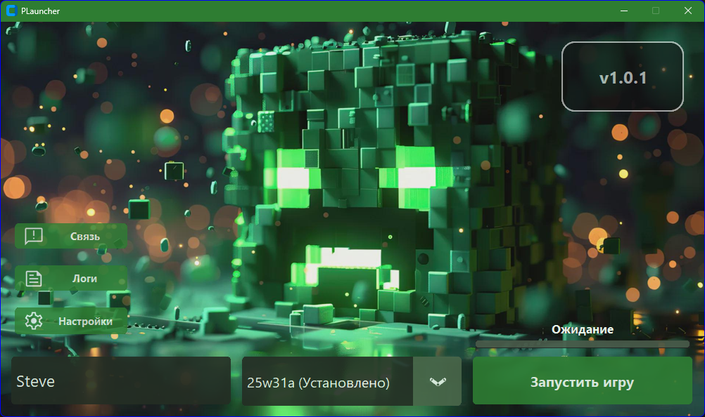
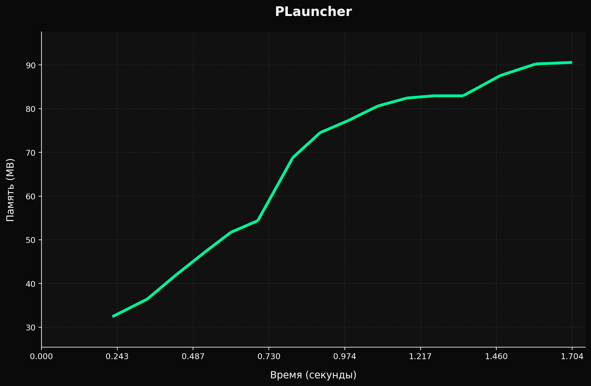

<div align="right">
  <b>🌐 <a href="README_RU.md">🇷🇺 Русский</a> | English</b>
</div>

# PLauncher

[](https://github.com/PLauncher-Team/PLauncher/releases)
[](https://github.com/PLauncher-Team/PLauncher/actions/workflows/build-windows-release.yml)

<div align="center">
  
</div>

**PLauncher** is a convenient and lightweight Minecraft launcher that combines support for official versions, mods, and skin customization. It provides fast game launching and simple configuration through an intuitive interface.

---

## 📚 Table of Contents
- [Installation](#-installation)
- [Requirements](#-requirements)
- [Key Features](#-key-features)
- [Building from Source](#-building-from-source)
- [Development Mode](#-development-mode)
- [Resources](#-resources)
- [License](#-license)
- [Support the Project](#-support-the-project-donations)
- [Disclaimer](#-disclaimer)

---

## 📥 Installation

To install PLauncher, follow these simple steps:

1. Go to the [releases page](https://github.com/PLauncher-Team/PLauncher/releases) on GitHub.
2. Download the latest version.
3. Run the installer.
4. Follow the on-screen instructions.

---

## 💻 Requirements

* Windows 10 (64-bit) or newer
* Broadband internet connection

---

## ⭐ Key Features

* **Automatic Minecraft Version Management**

    * Download official releases, snapshots, and legacy alpha/beta builds.

* **Profile Management**

    * Create, select, and delete fully isolated profiles with separate game data and settings.

* **Java Configuration**

    * Full Java version management
    * Ability to add JVM arguments

* **Mod Loader Support**

    * Built-in support for Forge, Fabric, Quilt, NeoForge, OptiFine, Cleanroom.
    * Browse and install available loader versions with a single click.

* **Localization**

    * Multi-language support: English, Русский, Español, Українська.

* **Ely.by Support**

    * Full skin management: preview, upload, and change your appearance.

* **Log Viewer**

    * View crash logs and instantly get solutions through AI-powered analysis!

* **Offline Launch**
    * Launch Minecraft without authentication or an internet connection.

* **Performance & Lightweight**
<table border="0">
  <tr>
    <td width="40%">
      <p><b>Instant Launch:</b> the launcher is fully ready to use in less than 3 seconds.</p>
      <p><b>Minimal Resource Usage:</b> peaks at up to 100 MB of RAM, making it one of the most lightweight launchers available.</p>
      <p><b>Compact Size:</b> the installer itself weighs no more than 30 MB.</p>
    </td>
    <td width="60%">
      
    </td>
  </tr>
</table>

---

## 🛠 Building from Source

To build **PLauncher** from source, follow the steps below.

### Prerequisites

* **Python 3.10+**: [https://www.python.org/downloads/release/python-3100/](https://www.python.org/downloads/release/python-3100/)
* **Microsoft C++ Build Tools**: [https://visualstudio.microsoft.com/visual-cpp-build-tools/](https://visualstudio.microsoft.com/visual-cpp-build-tools/)
* **Git**: [https://git-scm.com/downloads](https://git-scm.com/downloads)

### Steps

1. **Clone the repository**

   ```bash
   git clone https://github.com/PLauncher-Team/PLauncher.git
   cd PLauncher
   ```

2. **Run the build script**

   ```bash
   python build.py
   ```
    * Automatically installs all dependencies and generates `main.exe` (Windows) in `dist/main.dist/` using Nuitka

3. **Run the built executable**

   ```bash
   cd dist/main.dist
   ./main.exe
   ```

You now have a locally built copy of **PLauncher**, ready for testing or distribution! 🙌

---

## 🚀 Development Mode

During development, you can quickly set up and run the application using our `run.py` script:

### Prerequisites

* **Git**: [https://git-scm.com/downloads](https://git-scm.com/downloads)
* **Python 3.10+**: [https://www.python.org/downloads/release/python-3100/](https://www.python.org/downloads/release/python-3100/)

### Steps

1. **Clone the repository**
   ```bash
   git clone https://github.com/PLauncher-Team/PLauncher.git
   cd PLauncher
    ```

2. **From the project root, run:**

   ```bash
   python run.py
   ```
    * This will launch `main.py` in development mode.


---

## 📦 Resources

See [USED\_LIBS.md](USED_LIBS.md) for a complete list of licenses for the libraries used.

---

## 📄 License

This project is licensed under the [GPL-3.0](LICENSE).

---

## 📢 Disclaimer

PLauncher is an independent project and is **not affiliated with Mojang, Microsoft, or Minecraft**.  
All trademarks, including "Minecraft", are the property of their respective owners.  
Please purchase the game at [minecraft.net](https://www.minecraft.net/) to support the official developers.

---

## 💰 Support the Project (Donations)

If you enjoy PLauncher, please support us with a cryptocurrency donation:

| Cryptocurrency | Address                                      | QR Code                                                |
|----------------|----------------------------------------------|--------------------------------------------------------|
| USDT (TRC20)   | `THqGaKcE2Lui483fqpaFxYMqXZ5wgcSHJA`         |   |
| Bitcoin        | `bc1qgsnfj0de6fm89thpqev0xcc3483kunrtf56e9z` |     |
| Ethereum       | `0x5132B071b4bFFd5a3ccAF70448166DAB590bA0F2` |     |

Thank you for your support! 🙏
